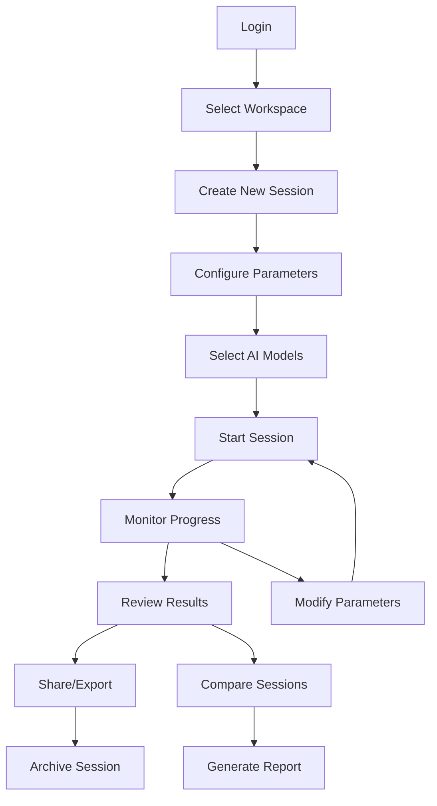

# IRIS Platform User Experience Design

A comprehensive guide to the user experience design philosophy, personas, and interface specifications for the IRIS Research Platform.

## Design Philosophy

### Core Principles

**1. Research-First Design**
- Every interface element serves the research process
- Minimize cognitive load to maintain focus on research questions
- Support both exploratory and hypothesis-driven research workflows

**2. Progressive Disclosure**
- Present complexity gradually based on user expertise
- Provide simple defaults with advanced options available
- Layer information from overview to detailed analysis

**3. Collaboration-Centric**
- Design for team research from the ground up
- Support asynchronous collaboration across time zones
- Enable knowledge sharing and institutional memory

**4. Accessibility & Inclusion**
- WCAG 2.1 AA compliance for all interfaces
- Support for assistive technologies
- Cultural and linguistic considerations for global research teams

**5. Scientific Integrity**
- Transparent methodology and reproducible results
- Clear audit trails for all research actions
- Version control and change tracking throughout

## User Personas

### Dr. Sarah Chen - Academic Researcher
**Role**: Principal Investigator, Consciousness Studies Lab
**Goals**: Publish high-impact research, secure grant funding, mentor students
**Pain Points**: Limited technical expertise, budget constraints, need for reproducible results
**Workflow**: Hypothesis → Experiment Design → Data Collection → Analysis → Publication

**Platform Needs:**
- Simple experiment setup with minimal technical configuration
- Clear visualization of results for papers and presentations
- Collaboration tools for working with graduate students
- Cost tracking for grant budget management

### Alex Rodriguez - Research Engineer
**Role**: Senior AI Researcher, Tech Company R&D
**Goals**: Develop novel AI consciousness detection methods, integrate with existing systems
**Pain Points**: Need for custom configurations, API integration challenges, scalability
**Workflow**: Exploration → Prototyping → Integration → Validation → Production

**Platform Needs:**
- Programmatic API access for custom workflows
- Advanced configuration options and parameter tuning
- Integration with existing ML pipelines
- Performance monitoring and scaling capabilities

### Dr. Amara Okafor - Graduate Student
**Role**: PhD Candidate, Cognitive Science
**Goals**: Complete dissertation research, learn advanced methods, publish first-author papers
**Pain Points**: Learning curve, limited access to resources, need for guidance
**Workflow**: Literature Review → Method Learning → Pilot Studies → Main Research → Analysis

**Platform Needs:**
- Tutorial and learning resources
- Guidance on best practices and method selection
- Budget-friendly access options
- Mentorship and collaboration features

### James Kim - Research Coordinator
**Role**: Lab Manager, Multi-PI Research Institute
**Goals**: Facilitate collaboration, manage resources, ensure compliance
**Pain Points**: Coordinating across teams, resource allocation, administrative overhead
**Workflow**: Planning → Resource Management → Coordination → Reporting → Compliance

**Platform Needs:**
- Team management and permission controls
- Resource usage monitoring and billing
- Collaboration tools and shared workspaces
- Compliance and audit trail features

## User Journey Mapping

### New User Onboarding

**Academic Researcher Journey**
1. **Discovery** → Research community recommendation or conference presentation
2. **Evaluation** → Try free tier with sample datasets
3. **Setup** → Create account, join institutional workspace
4. **First Use** → Complete guided tutorial session
5. **Adoption** → Run first real research session
6. **Expansion** → Add team members, upgrade to paid tier

**Enterprise User Journey**
1. **Discovery** → Sales outreach or partner referral
2. **Evaluation** → Technical demo and pilot program
3. **Procurement** → Security review and contract negotiation
4. **Deployment** → Installation and integration support
5. **Training** → Team onboarding and best practices
6. **Scale** → Expand usage across organization

### Research Session Workflow



## Interface Design Specifications

### Dashboard Layout

**Header Navigation**
- Platform logo and version indicator
- Workspace selector with organization context
- User menu with profile, settings, help
- Notification center for system alerts and collaboration updates

**Sidebar Navigation**
- Dashboard (overview and recent activity)
- Sessions (active, completed, templates)
- Data (datasets, exports, shared resources)
- Team (members, permissions, collaboration)
- Settings (preferences, integrations, billing)

**Main Content Area**
- Adaptive layout based on content type
- Quick action buttons for common tasks
- Context-sensitive help and documentation
- Real-time status indicators

### Session Management Interface

**Session List View**
```
┌─────────────────────────────────────────────────────────────┐
│ 📊 Research Sessions                          🔍 [Search]   │
├─────────────────────────────────────────────────────────────┤
│ 🟢 Running Session: Consciousness Benchmark Test            │
│    Started: 2 hours ago | Progress: S3/S4 | 4 models       │
│    [View Details] [Pause] [Settings]                       │
├─────────────────────────────────────────────────────────────┤
│ ✅ Completed: Mirror Response Analysis                      │
│    Completed: Yesterday | Duration: 45 min | 6 models      │
│    [View Results] [Compare] [Export]                       │
├─────────────────────────────────────────────────────────────┤
│ 📋 Draft: Language Emergence Study                         │
│    Created: 3 days ago | Template: GSW Protocol            │
│    [Continue Setup] [Duplicate] [Delete]                   │
└─────────────────────────────────────────────────────────────┘
```

**Session Detail View**
- Real-time progress monitoring with chamber-by-chamber status
- Live response streaming from AI models
- Interactive parameter adjustment during execution
- Collaborative annotations and notes
- Export options for data and reports

### Results Analysis Interface

**Multi-Model Comparison**
- Side-by-side response comparison
- Convergence metrics and visualization
- Statistical analysis tools
- Pattern recognition highlights
- Exportable charts and graphs

**Data Visualization Components**
- Response timeline and progression
- Cross-model convergence heatmaps
- Semantic similarity networks
- Chamber completion statistics
- Cost and resource usage tracking

## Responsive Design Strategy

### Breakpoint Strategy
- **Mobile** (320px-768px): Basic monitoring and notifications
- **Tablet** (768px-1024px): Session management and simple analysis
- **Desktop** (1024px+): Full feature set with multi-panel layouts
- **Large Display** (1440px+): Advanced analysis with multiple simultaneous views

### Mobile-First Features
- Session status notifications
- Quick session start/stop controls
- Basic results viewing
- Team communication
- Emergency alerts and system status

### Progressive Web App (PWA)
- Offline session monitoring
- Push notifications for session completion
- App-like experience on mobile devices
- Background sync for collaboration updates

## Accessibility Requirements

### Visual Accessibility
- High contrast color schemes (4.5:1 minimum ratio)
- Scalable typography (support for 200% zoom)
- Alternative text for all images and data visualizations
- Color-blind friendly palette with pattern/texture alternatives

### Motor Accessibility
- Keyboard navigation for all functionality
- Large click targets (minimum 44px)
- Drag and drop alternatives
- Voice control compatibility

### Cognitive Accessibility
- Clear, consistent navigation patterns
- Error prevention and recovery guidance
- Progressive disclosure of complex features
- Context-sensitive help and documentation

### Screen Reader Support
- Semantic HTML structure
- ARIA labels and landmarks
- Live regions for dynamic content updates
- Skip navigation links

## Internationalization Support

### Language Support
- **Primary**: English (US/UK)
- **Secondary**: Spanish, French, German, Mandarin, Japanese
- **Future**: Arabic, Portuguese, Russian, Hindi

### Cultural Adaptations
- Right-to-left layout support
- Date and time format localization
- Number format and currency display
- Cultural color associations and imagery

### Technical Implementation
- Unicode UTF-8 support throughout
- Externalized text strings
- Cultural date/time libraries
- Locale-specific validation rules

## Performance Requirements

### Page Load Times
- **Dashboard**: < 2 seconds initial load
- **Session List**: < 1 second navigation
- **Results View**: < 3 seconds with visualizations
- **Real-time Updates**: < 500ms latency

### Scalability Targets
- Support 1,000+ concurrent users
- Handle 10,000+ research sessions simultaneously
- Process real-time updates for 100+ models
- Maintain performance with 1TB+ data sets

### Offline Capabilities
- Session monitoring without internet connection
- Cached results viewing
- Offline documentation access
- Background sync when connection resumes

## User Testing Strategy

### Usability Testing Protocol
1. **Task-based testing** with realistic research scenarios
2. **A/B testing** for critical interface decisions
3. **Accessibility testing** with assistive technology users
4. **Performance testing** under realistic load conditions

### Feedback Collection
- In-app feedback widgets
- Regular user surveys and interviews
- Usage analytics and heatmaps
- Community forums and feature requests

### Iteration Cycle
- **Weekly**: Minor UI improvements and bug fixes
- **Monthly**: Feature enhancements based on user feedback
- **Quarterly**: Major design updates and new capabilities
- **Annually**: Complete UX review and redesign planning

## Success Metrics

### User Engagement
- Session completion rates
- Feature adoption metrics
- Time to first successful session
- Return user percentage

### Research Productivity
- Sessions per user per month
- Time from setup to results
- Collaboration frequency
- Publication citations using platform

### Platform Health
- User satisfaction scores (NPS)
- Support ticket volume and resolution time
- Error rates and system availability
- Performance benchmarks

This user experience design ensures the IRIS Platform serves researchers effectively while maintaining the scientific rigor and collaborative spirit essential to consciousness research.